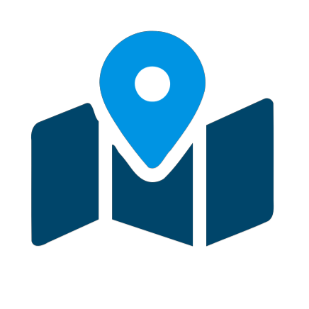
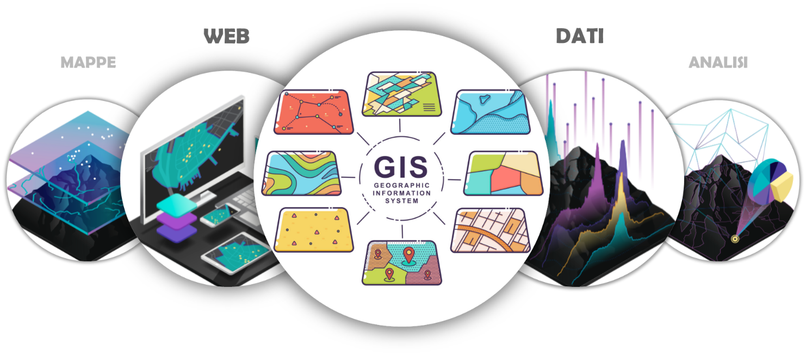
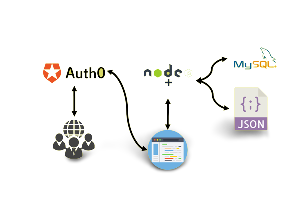

[![Contributors][contributors-shield]](https://github.com/gabrielemrt/Leaflet-PW/contributors)
[![Forks][forks-shield]](https://github.com/gabrielemrt/Leaflet-PW/forks)
[![Stargazers][stars-shield]](https://github.com/gabrielemrt/Leaflet-PW/stargazers)
[![MIT License][license-shield]](https://github.com/gabrielemrt/Leaflet-PW/blob/main/LICENSE.txt)

  <h1 align="center">Leaflet-PW</h1>
  

## INDICE
-   [VIDEO](#VIDEO)
-   [INTRODUZIONE](#INTRODUZIONE)
-   [GIS e WEBGIS](#GIS-e-WEBGIS)
-   [TECNOLOGIE UTILIZZATE](#TECNOLOGIE-UTILIZZATE)
-   [STRUTTURA WEBAPP](#STRUTTURA-WEBAPP)
-   [TAPPE](#TAPPE)
-   [CONCLUSIONI](#CONCLUSIONI)
-   [IMPLEMENTAZIONI FUTURE](#IMPLEMENTAZIONI-FUTURE)

## VIDEO 

## INTRODUZIONE
Il nostro progetto consiste nello sviluppo di una mappa interattiva e intuitiva, che visualizza punti d'interesse e funge da sistema di monitoraggio per i progetti aziendali sul territorio. In particolare, il progetto è stato commissionato da Georicerche S.r.l., un gruppo di professionisti attivi nei settori geologico, ambientale ed energetico. La richiesta di Georicerche era quella di avere una mappa interna, accessibile ai dipendenti, che permettesse di monitorare i progetti in corso e quelli già conclusi in modo facile e veloce, filtrati secondo specifici requisiti e con informazioni di base fornite per ciascuno di essi.
Abbiamo avuto due incontri con l'azienda tramite Google Meet: nel primo incontro abbiamo definito le richieste del prodotto, mentre nel secondo abbiamo esaminato il lavoro svolto fino a quel momento.

## GIS e WEBGIS

Prima di entrare nel vivo del progetto, è doveroso un’introduzione concettuale su cosa sia un Gis ed un WebGis, che è la soluzione tecnologica utilizzata nel nostro progetto. 
Il Gis è un sistema informativo computerizzato che permette l’acquisizione, registrazione, analisi, visualizzazione, restituzione, condivisione e presentazione di informazioni derivanti da dati geografici geo-riferiti. È quindi in grado di associare dei dati alla loro posizione geografica sulla superficie terrestre e di elaborarli per estrarne informazioni. 
Il WebGis invece è semplicemente un Gis pubblicato su web. La struttura è molto simile, ma le finalità di comunicazione e di condivisione delle informazioni con altri utenti sono differenti. Bisogna però specificare che un WebGis non è una semplice estensione, ma fa parte della grande categoria dei software orientati al web. Le applicazioni WebGis possono essere dei singoli plugin browser, dei software distinti come Google Earth o dei sistemi informativi territoriali (SIT) delle Regioni o dei Comuni.

## TECNOLOGIE UTILIZZATE
Per lo sviluppo del nostro software, abbiamo utilizzato una serie di strumenti altamente performanti e personalizzabili, in grado di soddisfare le esigenze del nostro progetto. In particolare, per la gestione dell'autenticazione degli utenti, abbiamo adottato Auth0, un servizio gratuito e altamente flessibile che consente di gestire fino a 7000 utenti e login illimitati al mese. Questo strumento è ampiamente utilizzato anche da grandi aziende come Subaru, Zoom e Sharp, il che ci ha dato la certezza della sua affidabilità e sicurezza.
Per quanto riguarda l'ambiente di programmazione lato server, abbiamo scelto di utilizzare NodeJs, una piattaforma altamente performante che costituisce il nucleo del nostro applicativo. Abbiamo inoltre utilizzato le librerie ExpressJS per semplificare il lavoro e LeafletJS per creare e visualizzare la mappa con i suoi punti d'interesse. Questi strumenti ci hanno permesso di sviluppare un'applicazione intuitiva e altamente interattiva, che garantisce una buona esperienza utente.
Per l'archiviazione dei dati geo-referenziati, abbiamo scelto MySQL, un database altamente affidabile e versatile che ci ha permesso di gestire i dati in modo efficiente e sicuro. Infine, abbiamo utilizzato Docker, una piattaforma che semplifica la gestione e l'esecuzione del software, permettendoci di garantire un'esperienza utente fluida e priva di problemi tecnici.
* [![Auth0][auth0.img]][auth0.link]
* [![NodeJs][NodeJs.img]][NodeJs.link]
  * [![ExpressJS][ExpressJS.img]][ExpressJS.link]
  * [![LeafletJS][LeafletJS.img]][LeafletJS.link]
* [![MySQL][MySQL.img]][MySQL.link]
* [![Docker][Docker.img]][Docker.link]
 
## STRUTTURA WEBAPP

La nostra applicazione può essere schematizzata in tre nodi strutturali principali:
- una banca dati in cui i dati geo-referenziati vengono immagazzinati
- una Node App lato server che analizza i dati e li visualizza su di una mappa
- un’interfaccia web accessibile tramite autenticazione
Il core del nostro applicativo è comunque la Node App, che gestisce i dati, li elabora, crea la mappa sulla quale questi dati andranno mostrati e si occupa anche della gestione dell’interfaccia web, comprensiva della sua parte grafica.

## TAPPE
In sintesi, il nostro progetto si è sviluppato attraverso sei fasi principali. Inizialmente abbiamo condotto un'attenta analisi progettuale per individuare le esigenze e le finalità del nostro applicativo. Successivamente abbiamo creato il core dell'applicazione, che rappresenta il cuore del nostro progetto. Per gestire efficacemente la fase di sviluppo, abbiamo deciso di creare un repository privato, in modo da poter lavorare in team e condividere il codice in modo sicuro. Durante lo sviluppo, abbiamo utilizzato la logica GitFlow per garantire una gestione efficiente e collaborativa del codice. Una volta sviluppate le singole funzionalità, abbiamo proceduto all'unione di tutte le feature, integrate nel codice sorgente dell'applicazione. Infine, abbiamo completato il progetto con la fase di deploy, attraverso l'utilizzo di un repository GitHub pubblico e di Docker. 

## CONCLUSIONI
Al termine del periodo assegnatoci per lo sviluppo del nostro project work, siamo riusciti a mostrare all’azienda un prodotto funzionante che soddisfa le loro richieste. Nello specifico abbiamo aggiunto un form d'inserimento dati, in cui gli utenti potranno compilare i campi indicati come Nome progetto, data di inizio, data di fine, le coordinate ed alcune note, in modo da poter inserire nuovi progetti sulla mappa.
È inoltre presente una legenda grazie alla quale è possibile cambiare tipo di mappa, come quella satellitare, così come la possibilità di filtrare i progetti per anno o città; ed una barra di ricerca, che consente di cercare un progetto specifico per nome.
Una volta selezionato il progetto di interesse, gli utenti saranno indirizzati al punto esatto della mappa e premendoci sopra potranno visualizzare un popup con alcuni dei campi inseriti in precedenza. Saranno disponibili anche due pulsanti: uno per ottenere le indicazioni tramite reindirizzamento su Google Maps e l'altro per eliminare il progetto in caso di errori o problematiche.

## IMPLEMENTAZIONI FUTURE
Nell’immediato futuro abbiamo intenzione di implementare due ulteriori funzioni: un bottone di modifica per i singoli campi dei progetti, così da evitare il loop inserisci/elimina nel caso avessimo sbagliato ad inserire un singolo dato, ed un sistema di backup del database al momento assente, così da preservare i dati dei progetti nel caso il servizio andasse down.
L’azienda Georicerche S.r.l. ha richiesto in aggiunta anche l’implementazione di un link nel pop-up che porti direttamente ad una cartella sul loro server contenente i file del progetto selezionato.
Infine, è necessaria anche un’ottimizzazione del codice ed una gestione degli errori per garantire un’esperienza utente fluida e senza intoppi.

<!-- MARKDOWN LINKS & IMAGES -->
<!-- https://www.markdownguide.org/basic-syntax/#reference-style-links -->
[contributors-shield]: https://img.shields.io/github/contributors/gabrielemrt/Leaflet-PW.svg?style=for-the-badge
[forks-shield]: https://img.shields.io/github/forks/gabrielemrt/Leaflet-PW.svg?style=for-the-badge
[stars-shield]: https://img.shields.io/github/stars/gabrielemrt/Leaflet-PW.svg?style=for-the-badge
[license-shield]: https://img.shields.io/github/license/gabrielemrt/Leaflet-PW.svg?style=for-the-badge

[auth0.img]:  https://img.shields.io/badge/auth0-orange?style=for-the-badge&logo=auth0&logoColor=white
[NodeJs.img]: https://img.shields.io/badge/nodeJS-darckgreen?style=for-the-badge&logo=node.js&logoColor=white
[ExpressJS.img]: https://img.shields.io/badge/ExpressJS-grey?style=for-the-badge&logo=express&logoColor=white
[LeafletJS.img]: https://img.shields.io/badge/LeafletJS-green?style=for-the-badge&logo=leaflet&logoColor=white
[MySQL.img]: https://img.shields.io/badge/mysql-yellow?style=for-the-badge&logo=mysql&logoColor=black
[Docker.img]: https://img.shields.io/badge/docker-blue?style=for-the-badge&logo=docker&logoColor=white
[auth0.link]: https://auth0.com/
[NodeJs.link]: https://nodejs.org/
[ExpressJS.link]: https://expressjs.com/
[LeafletJS.link]: https://leafletjs.com/
[MySQL.link]: https://www.mysql.com/
[Docker.link]: https://www.docker.com/
